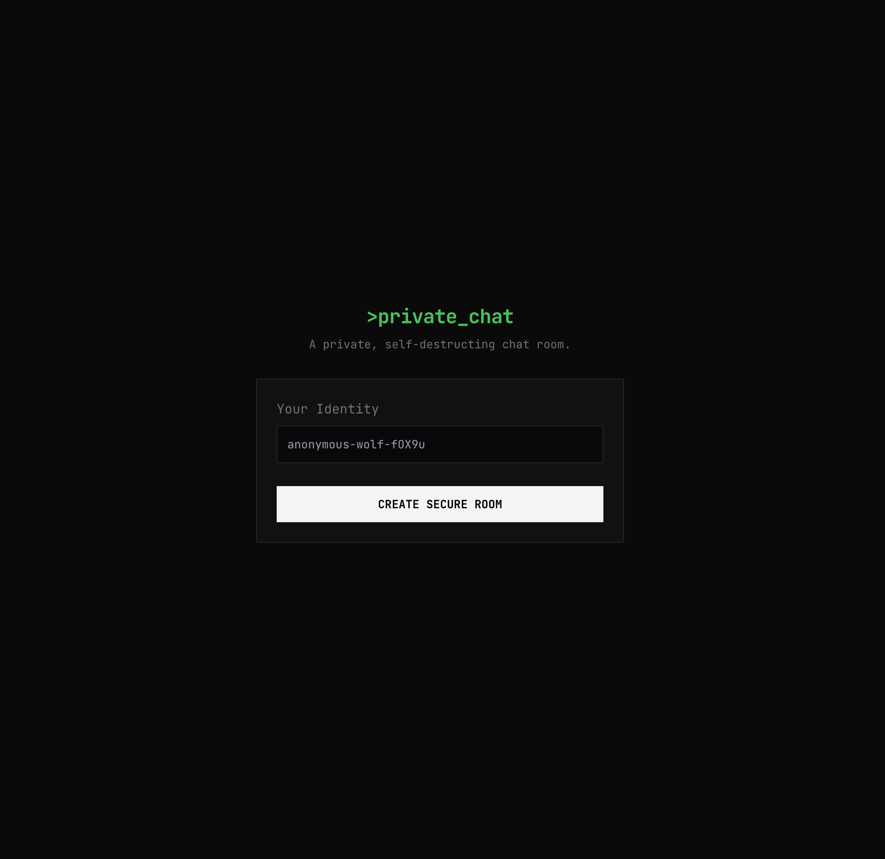
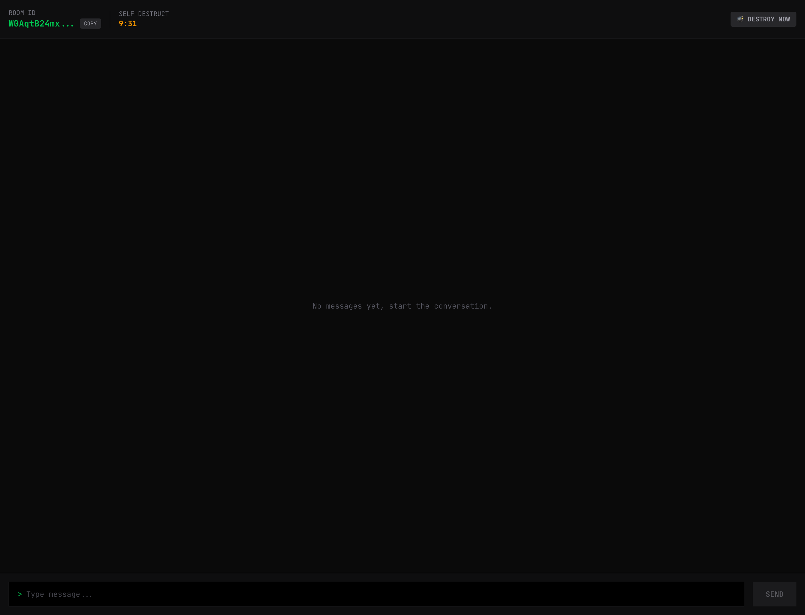

<div align="center">
  <br />
  <h1>Real-Time Chat Application</h1>
  
  <p align="center">
    <a href="https://secret-realtime-chat.vercel.app/" target="_blank">
      
    </a>
  </p>
  
  <br />

  <div>
     
     
    
    
    
    
    
  </div>

  <br />

  <p align="center">
    Modern, scalable real-time chat application demonstrating WebSocket-based communication and Redis pub/sub architecture
  </p>
</div>

## 📋 Table of Contents

1. ✨ [Introduction](#introduction)
2. ⚙️ [Tech Stack](#tech-stack)
3. 🔋 [Key Features](#key-features)
4. 🏗️ [Project Structure](#project-structure)
5. 💡 [How It Works](#how-it-works)
6. 🚀 [Quick Start](#quick-start)
7. 🔐 [Security](#security)
8. 📚 [Learning Resources](#learning-resources)

## 📸 Screenshots

<div align="center">
  <div style="display: inline-block; margin: 10px;">
    
    <p><em>Lobby - Create or join chat rooms</em></p>
  </div>
  <div style="display: inline-block; margin: 10px;">
    
    <p><em>Chat Room - Real-time messaging interface</em></p>
  </div>
</div>

## <a name="introduction">✨ Introduction</a>

Real-Time Chat Application is a comprehensive learning implementation focused on mastering **real-time communication technologies**. Built with Next.js 16 and TypeScript, this project demonstrates production-ready WebSocket integration, scalable Redis pub/sub patterns, and secure real-time messaging protocols.

### 🎯 Learning Objectives Achieved

✅ Real-time bidirectional communication using WebSocket API  
✅ Scalable architecture with Redis pub/sub patterns  
✅ Secure communication protocols (HTTPS, WSS)  
✅ Latency optimization through direct WebSocket connections  
✅ Security best practices with token-based authentication  
✅ Automatic resource cleanup and TTL management  
✅ Type-safe end-to-end API design

This project demonstrates concepts from WebSocket API, Redis Pub/Sub, secure protocols (WSS), latency management, fault-tolerant architectures, and scalability optimization.

## <a name="tech-stack">⚙️ Tech Stack</a>

### Core Stack

- **[Next.js 16](https://nextjs.org/)** - React framework with App Router, Server Components, and enhanced server-side rendering (SSR). Features automatic code splitting, optimized data fetching, and built-in API routes for full-stack development

- **[TypeScript](https://www.typescriptlang.org/)** - Strongly typed JavaScript superset providing better code quality, IntelliSense, and error detection at compile time

- **[React 19](https://react.dev/)** - Latest React version with enhanced hooks, improved concurrent features, and better performance optimizations

- **[Tailwind CSS 4](https://tailwindcss.com/)** - Utility-first CSS framework for rapid UI development with responsive design, dark mode support, and custom styling

### Real-Time Communication

- **[@upstash/realtime](https://upstash.com/docs/realtime/overall/getstarted)** - WebSocket-based real-time messaging SDK with automatic reconnection, event-driven architecture, and typed events

- **WebSocket (WSS)** - Secure, bidirectional, full-duplex communication protocol providing low-latency message delivery between clients and server

- **Server-Sent Events** - Real-time server-to-client updates for unidirectional data streaming

### Backend & Database

- **[Elysia.js](https://elysiajs.com/)** - Fast, type-safe backend framework with Eden Treaty for end-to-end type safety and built-in validation

- **[Redis](https://redis.io/)** (via [@upstash/redis](https://upstash.com/)) - In-memory database providing:
  - Message storage and history with sub-millisecond latency
  - Pub/Sub messaging pattern for horizontal scalability
  - Room metadata management
  - TTL-based automatic cleanup and memory optimization

### Type Safety & Validation

- **[Zod](https://zod.dev/)** - Runtime type validation and schema definition with TypeScript inference

- **[@elysiajs/eden](https://elysiajs.com/eden/overview.html)** - End-to-end type safety between client and server with automatic API contract generation

- **[@sinclair/typebox](https://github.com/sinclairzx81/typebox)** - JSON Schema Type Builder for runtime validation

### State Management & Data Fetching

- **[@tanstack/react-query](https://tanstack.com/query/latest)** - Powerful data synchronization, caching, and server state management with automatic refetching and optimistic updates

- **[date-fns](https://date-fns.org/)** - Modern date utility library with immutable functions and tree-shaking support

### Additional Tools

- **[nanoid](https://github.com/ai/nanoid)** - Secure, URL-friendly unique ID generator with cryptographic randomness

- **ESLint** - Code quality and consistency enforcement

- **React Compiler** - Automatic React optimizations and memoization

## <a name="key-features">🔋 Key Features</a>

### 1. **WebSocket-Based Real-Time Communication**

- Bidirectional, low-latency message delivery
- Automatic reconnection handling
- Event-driven architecture with typed events
- Support for multiple simultaneous connections

### 2. **Scalable Redis Pub/Sub Architecture**

```typescript
// Event publishing (server-side)
await realtime.channel(roomId).emit('chat.message', message);

// Event subscription (client-side)
useRealtime({
  channels: [roomId],
  events: ['chat.message', 'chat.destroy'],
  onData: ({ event }) => {
    // Handle real-time updates
  },
});
```

### 3. **Automatic Room Management**

- Time-to-live (TTL) based room expiration (10 minutes)
- Automatic cleanup of messages and metadata
- Real-time countdown display for room expiration
- Graceful handling of expired rooms

### 4. **Security Features**

- Token-based authentication for room access
- Message sender verification
- Input validation and sanitization
- Secure WebSocket connections (WSS)

### 5. **Type-Safe API Design**

```typescript
// End-to-end type safety with Elysia + Eden
const { data } = await client.messages.get({ query: { roomId } });
// TypeScript knows the exact shape of 'data'
```

## <a name="project-structure">🏗️ Project Structure</a>

```
realtime-chat/
├── src/
│   ├── app/
│   │   ├── api/
│   │   │   ├── [[...slugs]]/
│   │   │   │   ├── auth.ts           # Token-based authentication middleware
│   │   │   │   └── route.ts          # Elysia API routes (rooms & messages)
│   │   │   └── realtime/
│   │   │       └── route.ts          # WebSocket endpoint handler
│   │   ├── room/
│   │   │   └── [roomId]/
│   │   │       └── page.tsx          # Chat room UI with real-time updates
│   │   ├── globals.css               # Global styles with Tailwind
│   │   ├── layout.tsx                # Root layout with providers
│   │   └── page.tsx                  # Home page (room creation)
│   │
│   ├── components/
│   │   └── providers.tsx             # React Query provider setup
│   │
│   ├── hooks/
│   │   └── useUsername.ts            # Custom hook for username management
│   │
│   ├── lib/
│   │   ├── client.ts                 # Elysia Eden Treaty client
│   │   ├── realtime.ts               # Realtime event schema & config
│   │   ├── realtimeClient.ts         # Client-side realtime hook
│   │   └── redis.ts                  # Redis client initialization
│   │
│   ├── helper/
│   │   └── timer.ts                  # Timer utilities
│   │
│   └── proxy.ts                      # Development proxy configuration
│
├── public/                           # Static assets
├── eslint.config.mjs                 # ESLint configuration
├── next.config.ts                    # Next.js configuration
├── postcss.config.mjs                # PostCSS configuration
├── tailwind.config.js                # Tailwind CSS configuration
├── tsconfig.json                     # TypeScript configuration
└── package.json                      # Dependencies and scripts
```

## <a name="how-it-works">💡 How It Works</a>

### Message Flow Architecture

```
┌─────────────┐                 ┌──────────────┐                 ┌─────────────┐
│   Client A  │────WebSocket────│  Next.js API │────Pub/Sub─────│    Redis    │
└─────────────┘                 │   + Elysia   │                 └─────────────┘
                                └──────────────┘                        │
                                        │                               │
                                        │                               │
                                   WebSocket                        Pub/Sub
                                        │                               │
                                        ▼                               ▼
                                ┌──────────────┐                 ┌─────────────┐
                                │   Client B   │◄────────────────│ Subscribers │
                                └──────────────┘                 └─────────────┘
```

1. **Client sends message** → WebSocket connection to `/api/realtime`
2. **Server validates** → Token auth + input sanitization
3. **Redis stores** → Message persisted with TTL
4. **Pub/Sub broadcasts** → All connected clients receive update
5. **Clients update** → React Query cache invalidation + UI re-render

### Real-Time Event System

```typescript
// Server-side schema definition
const schema = {
  chat: {
    message: z.object({
      id: z.string(),
      sender: z.string(),
      text: z.string(),
      timestamp: z.number(),
      roomId: z.string(),
    }),
    destroy: z.object({
      isDestroyed: z.literal(true),
    }),
  },
};
```

## <a name="quick-start">🚀 Quick Start</a>

### Prerequisites

- Node.js 20+
- Redis instance (or Upstash Redis account)
- Package manager (npm, yarn, or pnpm)

### Environment Variables

Create a `.env.local` file:

```env
UPSTASH_REDIS_REST_URL=your_redis_url
UPSTASH_REDIS_REST_TOKEN=your_redis_token
NEXT_PUBLIC_APP_URL=https://your-domain.com  # Optional, auto-detected in client
```

### Installation

```bash
# Clone the repository
git clone https://github.com/yourusername/realtime-chat.git

# Navigate to project directory
cd realtime-chat

# Install dependencies
npm install

# Run development server
npm run dev

# Build for production
npm run build

# Start production server
npm start
```

Open [http://localhost:3000](http://localhost:3000) to view the application.

## <a name="security">🔐 Security Considerations</a>

- **WSS Protocol**: All WebSocket connections use secure WSS in production
- **Token Authentication**: Each client receives a unique token for message verification
- **Input Validation**: Zod schemas validate all inputs (max 100 chars for username, 1000 for messages)
- **TTL Management**: Automatic cleanup prevents data persistence beyond intended lifetime
- **CORS Protection**: API routes restricted to same-origin requests

## 🎨 UI Features

- Real-time message updates without page refresh
- Visual indication of own messages vs. others
- Live room expiration countdown
- Copy room link functionality
- Responsive design with Tailwind CSS
- Loading states and optimistic updates

## 📈 Performance Optimizations

- **React Query Caching**: Reduces unnecessary API calls
- **WebSocket Persistence**: Single long-lived connection per client
- **Redis In-Memory**: Ultra-fast message retrieval (<1ms latency)
- **React Compiler**: Automatic component memoization
- **Lazy Loading**: Dynamic imports for route-based code splitting

## 🧪 Testing Scalability

To test the Redis pub/sub scalability:

1. Open multiple browser tabs/windows
2. Join the same room from different devices
3. Send messages and observe instant delivery across all clients
4. Monitor Redis memory usage and connection count

## <a name="learning-resources">📚 Learning Resources</a>

This project demonstrates concepts from:

- [WebSocket API Documentation](https://developer.mozilla.org/en-US/docs/Web/API/WebSocket)
- [Redis Pub/Sub Pattern](https://redis.io/docs/manual/pubsub/)
- [Upstash Realtime Docs](https://upstash.com/docs/realtime)
- [Next.js Server Components](https://nextjs.org/docs/app)
- [Elysia.js Documentation](https://elysiajs.com/)

## 🙏 Acknowledgments

Special thanks to **[Josh Tried Coding](https://www.youtube.com/@joshtriedcoding)** for sharing this project and contributing to my learning journey in real-time communication technologies.

Watch the tutorial: [Building a Real-Time Chat App](https://www.youtube.com/watch?v=D8CLV-MRH0k)

## 🤝 Contributing

Contributions are welcome! Please feel free to submit a Pull Request.

## 📝 License

- **[Elysia.js](https://elysiajs.com/)** - Fast, type-safe backend framework
- **[Redis](https://redis.io/)** (via [@upstash/redis](https://upstash.com/)) - In-memory database for:
  - Message storage and history
  - Pub/Sub messaging pattern
  - Room metadata management
  - TTL-based automatic cleanup

### Type Safety & Validation

- **[Zod](https://zod.dev/)** - Runtime type validation and schema definition
- **[@elysiajs/eden](https://elysiajs.com/eden/overview.html)** - End-to-end type safety between client and server
- **[@sinclair/typebox](https://github.com/sinclairzx81/typebox)** - JSON Schema Type Builder

### State Management & Data Fetching

- **[@tanstack/react-query](https://tanstack.com/query/latest)** - Powerful data synchronization and caching
- **[date-fns](https://date-fns.org/)** - Modern date utility library

### Additional Tools

- **[nanoid](https://github.com/ai/nanoid)** - Secure, URL-friendly unique ID generator
- **ESLint** - Code quality and consistency
- **React Compiler** - Automatic React optimizations

## 🏗️ Project Structure

```
realtime-chat/
├── src/
│   ├── app/
│   │   ├── api/
│   │   │   ├── [[...slugs]]/
│   │   │   │   ├── auth.ts           # Token-based authentication middleware
│   │   │   │   └── route.ts          # Elysia API routes (rooms & messages)
│   │   │   └── realtime/
│   │   │       └── route.ts          # WebSocket endpoint handler
│   │   ├── room/
│   │   │   └── [roomId]/
│   │   │       └── page.tsx          # Chat room UI with real-time updates
│   │   ├── globals.css               # Global styles with Tailwind
│   │   ├── layout.tsx                # Root layout with providers
│   │   └── page.tsx                  # Home page (room creation)
│   │
│   ├── components/
│   │   └── providers.tsx             # React Query provider setup
│   │
│   ├── hooks/
│   │   └── useUsername.ts            # Custom hook for username management
│   │
│   ├── lib/
│   │   ├── client.ts                 # Elysia Eden Treaty client
│   │   ├── realtime.ts               # Realtime event schema & config
│   │   ├── realtimeClient.ts         # Client-side realtime hook
│   │   └── redis.ts                  # Redis client initialization
│   │
│   ├── helper/
│   │   └── timer.ts                  # Timer utilities
│   │
│   └── proxy.ts                      # Development proxy configuration
│
├── public/                           # Static assets
├── eslint.config.mjs                 # ESLint configuration
├── next.config.ts                    # Next.js configuration
├── postcss.config.mjs                # PostCSS configuration
├── tailwind.config.js                # Tailwind CSS configuration
├── tsconfig.json                     # TypeScript configuration
└── package.json                      # Dependencies and scripts
```

## 🔧 Key Features

### 1. **WebSocket-Based Real-Time Communication**

- Bidirectional, low-latency message delivery
- Automatic reconnection handling
- Event-driven architecture with typed events
- Support for multiple simultaneous connections

### 2. **Scalable Redis Pub/Sub Architecture**

```typescript
// Event publishing (server-side)
await realtime.channel(roomId).emit('chat.message', message);

// Event subscription (client-side)
useRealtime({
  channels: [roomId],
  events: ['chat.message', 'chat.destroy'],
  onData: ({ event }) => {
    // Handle real-time updates
  },
});
```

### 3. **Automatic Room Management**

- Time-to-live (TTL) based room expiration (10 minutes)
- Automatic cleanup of messages and metadata
- Real-time countdown display for room expiration
- Graceful handling of expired rooms

### 4. **Security Features**

- Token-based authentication for room access
- Message sender verification
- Input validation and sanitization
- Secure WebSocket connections (WSS)

### 5. **Type-Safe API Design**

```typescript
// End-to-end type safety with Elysia + Eden
const { data } = await client.messages.get({ query: { roomId } });
// TypeScript knows the exact shape of 'data'
```

## 🚦 Getting Started

### Prerequisites

- Node.js 20+
- Redis instance (or Upstash Redis account)
- Package manager (npm, yarn, or pnpm)

### Environment Variables

Create a `.env.local` file:

```env
UPSTASH_REDIS_REST_URL=your_redis_url
UPSTASH_REDIS_REST_TOKEN=your_redis_token
```

### Installation

```bash
# Install dependencies
npm install

# Run development server
npm run dev

# Build for production
npm run build

# Start production server
npm start
```

Open [http://localhost:3000](http://localhost:3000) to view the application.

## 💡 How It Works

### Message Flow Architecture

```
┌─────────────┐                 ┌──────────────┐                 ┌─────────────┐
│   Client A  │────WebSocket────│  Next.js API │────Pub/Sub─────│    Redis    │
└─────────────┘                 │   + Elysia   │                 └─────────────┘
                                └──────────────┘                        │
                                        │                               │
                                        │                               │
                                   WebSocket                        Pub/Sub
                                        │                               │
                                        ▼                               ▼
                                ┌──────────────┐                 ┌─────────────┐
                                │   Client B   │◄────────────────│ Subscribers │
                                └──────────────┘                 └─────────────┘
```

1. **Client sends message** → WebSocket connection to `/api/realtime`
2. **Server validates** → Token auth + input sanitization
3. **Redis stores** → Message persisted with TTL
4. **Pub/Sub broadcasts** → All connected clients receive update
5. **Clients update** → React Query cache invalidation + UI re-render

### Real-Time Event System

```typescript
// Server-side schema definition
const schema = {
  chat: {
    message: z.object({
      id: z.string(),
      sender: z.string(),
      text: z.string(),
      timestamp: z.number(),
      roomId: z.string(),
    }),
    destroy: z.object({
      isDestroyed: z.literal(true),
    }),
  },
};
```

## 🔐 Security Considerations

- **WSS Protocol**: All WebSocket connections use secure WSS in production
- **Token Authentication**: Each client receives a unique token for message verification
- **Input Validation**: Zod schemas validate all inputs (max 100 chars for username, 1000 for messages)
- **TTL Management**: Automatic cleanup prevents data persistence beyond intended lifetime
- **CORS Protection**: API routes restricted to same-origin requests

## 🎨 UI Features

- Real-time message updates without page refresh
- Visual indication of own messages vs. others
- Live room expiration countdown
- Copy room link functionality
- Responsive design with Tailwind CSS
- Loading states and optimistic updates

## 📈 Performance Optimizations

- **React Query Caching**: Reduces unnecessary API calls
- **WebSocket Persistence**: Single long-lived connection per client
- **Redis In-Memory**: Ultra-fast message retrieval (<1ms latency)
- **React Compiler**: Automatic component memoization
- **Lazy Loading**: Dynamic imports for route-based code splitting

## 📚 Learning Resources

This project demonstrates concepts from:

- [WebSocket API Documentation](https://developer.mozilla.org/en-US/docs/Web/API/WebSocket)
- [Upstash Redis Pub/Sub Pattern](https://upstash.com/docs/redis/overall/getstarted)
- [Upstash Realtime Docs](https://upstash.com/docs/realtime)
- [Next.js Server Components](https://nextjs.org/docs/app)
- [Elysia.js Documentation](https://elysiajs.com/)

## 🤝 Contributing

Contributions are welcome! Please feel free to submit a Pull Request.

## � Acknowledgments

Special thanks to **[Josh Tried Coding](https://www.youtube.com/@joshtriedcoding)** for sharing this project and contributing to my learning journey in real-time communication technologies.

Watch the tutorial: [Building a Real-Time Chat App](https://www.youtube.com/watch?v=D8CLV-MRH0k)

---

**Built to learn WebSockets, Redis Pub/Sub, and Real-Time Communication**
